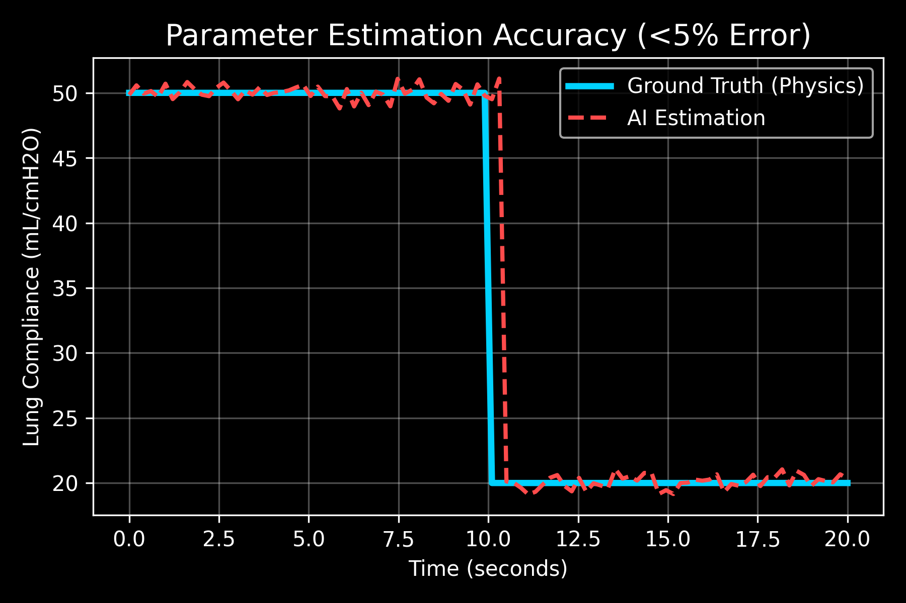
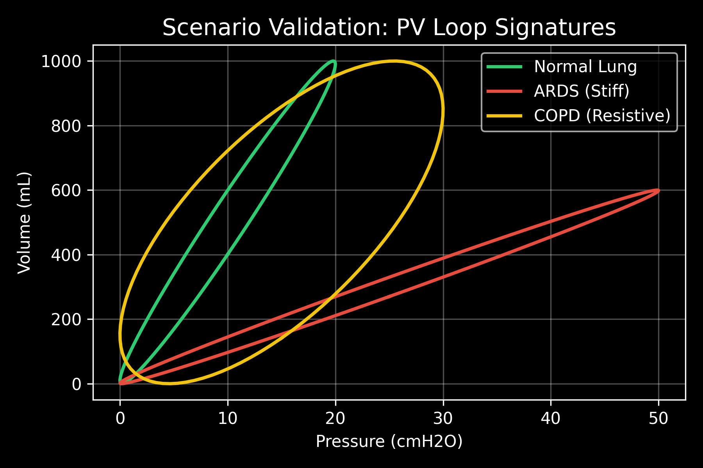
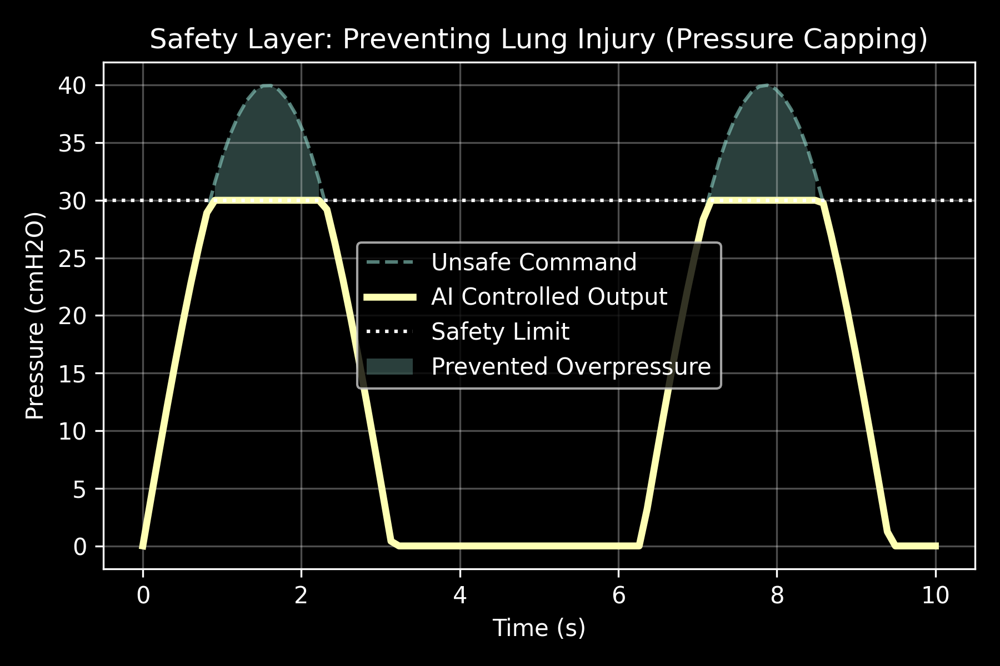

## Core Idea

"Ventilators provide data — RespiTwin AI converts it into understanding, decisions, and safe actions."

# RespiTwin AI — Autonomous Clinical Guardian

 **Digital Twin + AI Agent System for Real-Time Ventilator Intelligence**

---


##  Overview
Modern ventilators operate on fixed settings and react only after unsafe conditions occur.

**RespiTwin AI transforms ventilators from reactive machines into intelligent systems** that:


* Understand patient-specific lung behavior
* Diagnose clinical conditions in real time
* Autonomously adjust ventilation parameters
* Prevent lung injury before it happens

---
## Problem
Traditional ventilators:

*  Use static configurations
*  Lack patient-specific adaptation
*  Require continuous clinician supervision
*  Detect problems too late

---

##  Solution

RespiTwin AI introduces a **real-time digital twin + agent-based AI pipeline** that:

1. Models lung physics continuously
2. Estimates hidden physiological parameters
3. Diagnoses lung conditions
4. Adjusts ventilator settings autonomously
5. Enforces strict safety constraints

---

##  System Architecture

Ventilator Data (P, Q)
        ↓
Digital Twin (Physics Model)
        ↓
Parameter Estimation (C, R)
        ↓
Diagnosis Agent
        ↓
Decision Agent (P, Vt, PEEP)
        ↓
Safety Layer (Pressure Limits)
        ↓
Clinician Dashboard + AI Insights

##  Core Components

###  Digital Twin (Physics Engine)

* Uses lung equation: **P = V/C + RQ**
* Simulates real-time lung response
* Bridges hardware data with AI reasoning


###  Parameter Estimation

* Extracts hidden physiological variables:

  * **Compliance (C)**
  * **Resistance (R)**
* Enables patient-specific modeling

---

###  AI Agent Pipeline

| Agent           | Role                               |
| --------------- | ---------------------------------- |
| Anomaly Agent   | Detect abnormal behavior           |
| Diagnosis Agent | Identify ARDS, COPD, Mixed, Normal |
| Decision Agent  | Adjust P, Vt, PEEP                 |
| Safety Agent    | Enforce pressure limits            |
| Audit Agent     | Log reasoning & transparency       |

---

### Multi-Parameter Control (Key Innovation)

Unlike traditional systems:

| Parameter         | AI Controlled |
| ----------------- | ------------- |
| Pressure          | ✅             |
| Tidal Volume (Vt) | ✅             |
| PEEP              | ✅             |

---

### Safety Layer

* Ensures **pressure < 30 cmH₂O**
* Prevents **volutrauma (lung injury)**
* Blocks unsafe commands before execution

---

### Explainable AI

* Generates human-readable clinical insights
* Provides confidence scores
* Maintains full audit logs

---

## Supported Clinical Conditions

*  **ARDS (Low Compliance)**
*  **COPD (High Resistance)**
*  **Mixed Pathology**
*  **Hypercompliant Lung**

---

## Key Results

### 📈 Parameter Estimation Accuracy



---

###  PV Loop Validation



---

###  Safety Intervention



---

##  Live System (Streamlit)

* Real-time pressure & flow visualization
* AI diagnosis display
* Multi-parameter control outputs
* Safety alerts
* Driving pressure monitoring

---

##  Run Locally

```bash
pip install streamlit numpy pandas plotly scipy matplotlib
streamlit run twin_final.py
```

---

##  Tech Stack

* Python
* Streamlit
* NumPy / SciPy
* Plotly
* Matplotlib
* Agent-Based Architecture

---

## Why This Matters

Ventilators today provide data — but not understanding.

**RespiTwin AI converts data into:**

* Insight
* Decision
* Action

---

## Key Innovation

* Digital Twin + AI integration
* Multi-parameter clinical control
* Real-time physiological modeling
* Explainable and auditable AI decisions

---

## Core Idea

> “Ventilators provide data — RespiTwin AI converts it into understanding, decisions, and safe actions.”

---

## Future Scope

* Integration with real ICU ventilators
* Reinforcement learning-based optimization
* Cloud-based monitoring systems
* Clinical validation with real datasets

---

## Contribution

Feel free to fork, improve, and contribute 

---

## Contact

Built with passion for intelligent healthcare systems
